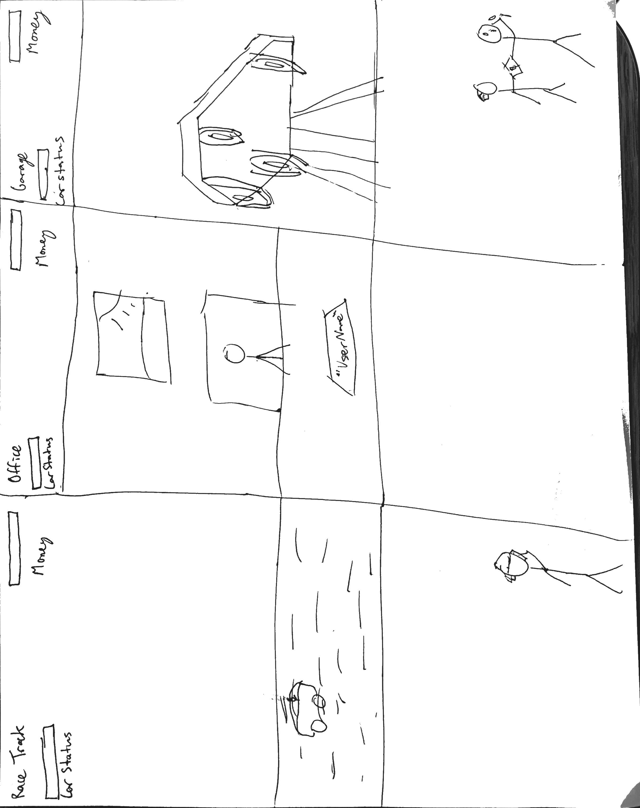

# Need For Cash

By kendell Rennie and Luis Figueroa

Manage your racing team to victory. Make sure they are well funded and have everything they need to win. Avoid scams ,and bad investments  to keep your races future safe

# Influences (Brief)
Need For Speed:
- Medium: Drag racing game. 
- Explanation: Just like Need For Speed this game involves the life of a street racer but you won’t do the racing, instead you will be the racer’s financial agent.

Football Manager: 
- Medium: PC game
- Explanation: manage your team and draft the best players to win 
## Core Gameplay Mechanics (Brief)
- Your racer’s car becomes damaged
- Racer loses a race 
- Racer wins a race
- Make sure money is available for maintenance, repairs and staff
- Recognize bad investments 
- Take good investments
- Know when to borrow from that bank 
- Have a bank account 
# Learning Aspects
## Learning Domains
Managing finances
## Target Audiences
- College students
- High school students 
## Target Contexts
- Business classes
## Learning Objectives
- Analyze the factors that affect financial stability
- Create a monthly budget 
- Will be able to explain what is a bad investment 
- Demonstrate how to manage financial debt
## Prerequisite Knowledge
- They need to know basic linear algebra
## Assessment Measures
Each level will have specific life situations that the player will have to make specific decisions on to improve the racer’s finances and prevent them from going broke. 
# What sets this project apart?
This is one of the only racing games where you aren’t doing the racing 
# Player Interaction Patterns and Modes
# Player Interaction Pattern
This game is for one player where they are clicking their decisions in the game. 
# Player Modes
- Player mode #1: Agent mode; you’re a financial agent and have to make sure your racer doesn’t run out of money between each race as they excel to each competition

- Player mode #2: Race mode; you’re the racer and this isn’t unlocked until you’ve completed the agent mode
# Gameplay Objectives
Primary Objective #1: Avoid bankruptcy 
- Description: financing repairs and staff will be expensive so don't overreach
- Alignment: Your moneybar will decrease drastically if you don't watch how you spend

Primary Objective #2: Advance to the next level
- Description: as your racer wins more you get more prize money. Choose where the racer wil race next.
- Alignment: As you advance each level, your competition becomes more fierce 

Primary Objective #3:Avoid scams and bad investments
- Description: as you level up there will be more opportunities to gain capital there will also be more risky and binding investments 
- Alignment: There will be more opportunities for your racer to make money as you advance
# Procedures/Actions
You can click the decisons buttons based on each experience in the game and toggle between the reace track, office, or mecahanic
# Rules
- What resources are available to the player that they make use of? How does this affect gameplay? How are these resources finite?

- The player will start off with some money and a racer. They must manage the team to victory.
# Objects/Entities
- The cars.
- The maintenance staff and driver.
- Banks and investors
- Credit score. 
## Core Gameplay Mechanics (Detailed)
- Take you car and racers to games and hop they win money
- Use that money for upgrades and larger capital
- Pick the right investment without going bankrupt 
# Feedback
- When you are losing money your money bar is red
- When you gain money your bar turns green
- Your racer performs better in races if you upgrade his car
# Story and Gameplay
## Presentation of Rules
During the beginning stages of the game there would be a tutorial where the game would highlight what the player could click on and explain its purpose in the game.  
# Presentation of Content
- By incorporating financial jargon within gameplay such as “interest rate”, “APR” and credit score.
# Story (Brief)
You must use your monetary wits to guide your drag racer to victory not on the race track but in the financial world.   
# Storyboarding

 
# Assets Needed
## Aesthetics
Depending on the time we have left it will be a blank white background with stick figures as characters.Or it will have detailed pixel art characters with a background 
# Graphical
- Car garage 
- Car (main character)
- Car states 
- Damages and maintenance repair  
- Textures:
-- Stick figures 
-- Environment Art/Textures:
--White background 
# Audio
- Game region/phase/time are ways of designating a particularly important place in the game.
- General gameplay: Sekiro music 
- Game Interactions are things that trigger SFX, like character movement, hitting a spiky enemy, collecting a coin.
- Sound List (SFX)
-- Car sounds
-- Wrenching and hammer sounds
-- Money sounds